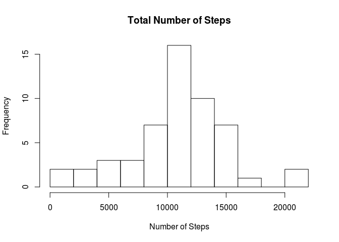
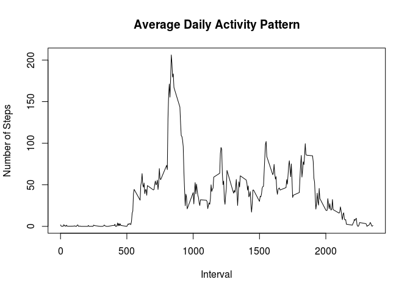
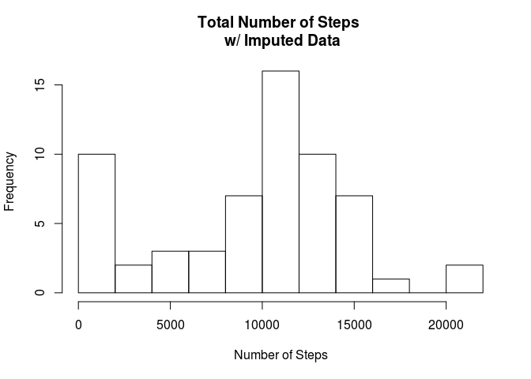
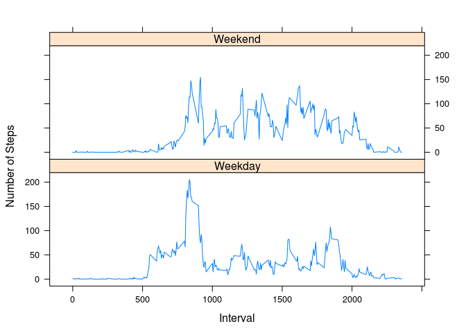

# Reproducible Research: Peer Assessment 1


## Loading and preprocessing the data
1. Load the data

```r
rawData <- read.csv("activity.csv",quote="\"")
```
2. Preprocess the data  
Converting data will be done later.  

## What is mean total number of steps taken per day?
1. Calculate the total number of steps taken per day

```r
aggregatedRawData <- aggregate(steps ~ date, data=rawData, sum, na.rm = TRUE)
```
2. If you do not understand the difference between a histogram and a barplot, research the difference between them. Make a histogram of the total number of steps taken each day

```r
hist(aggregatedRawData$steps, breaks=10, main="Total Number of Steps", xlab="Number of Steps", ylab="Frequency")
```

<!-- -->
  
3. Calculate and report the mean and median of the total number of steps taken per day

```r
mean_step <- mean(aggregatedRawData$steps)
median_step <- median(aggregatedRawData$steps)
```
The **mean** of total number of steps is:  

```
## [1] 10766.19
```
The **median** of total number of steps is:  

```
## [1] 10765
```

## What is the average daily activity pattern?  
1. Make a time series plot (i.e. type = "l") of the 5-minute interval (x-axis) and the average number of steps taken, averaged across all days (y-axis)  

```r
aggregatedMeanData <- aggregate(steps ~ interval, data=rawData, mean, na.rm = TRUE)
plot(aggregatedMeanData$interval, aggregatedMeanData$steps, type="l", main="Average Daily Activity Pattern", xlab="Interval", ylab="Number of Steps")
```

<!-- -->
  
2. Which 5-minute interval, on average across all the days in the dataset, contains the maximum number of steps?  


```r
maxInterval <- aggregatedMeanData[which.max(aggregatedMeanData$steps),]$interval
```
  
The maximum number of steps is contained in interval number: 

```
## [1] 835
```
     
## Imputing missing values  
1. Calculate and report the total number of missing values in the dataset (i.e. the total number of rows with NAs)  

```r
noOfNAs <- sum(is.na(rawData$steps))
```
Total number of missing values is:  

```
## [1] 2304
```
  
2. Devise a strategy for filling in all of the missing values in the dataset. The strategy does not need to be sophisticated. For example, you could use the mean/median for that day, or the mean for that 5-minute interval, etc.  
The missing values were filled with the median of the corresponding intervals. For median calculation NAs were omitted (na.rm = TRUE).  
3. Create a new dataset that is equal to the original dataset but with the missing data filled in.  

```r
imputedData <- rawData
medianOfInterval <- function(steps, interval) {
  if (!is.na(steps))
    value <- c(steps)
  else
    value <- median(imputedData$steps[imputedData$interval == interval], na.rm = TRUE)
  return(value)
}
imputedData$steps <- mapply(medianOfInterval, imputedData$steps, imputedData$interval)
processedImputedData <- aggregate(steps ~ date, data=imputedData, sum, na.rm = TRUE)
```
4. Make a histogram of the total number of steps taken each day and Calculate and report the mean and median total number of steps taken per day. Do these values differ from the estimates from the first part of the assignment? What is the impact of imputing missing data on the estimates of the total daily number of steps?  

```r
hist(processedImputedData$steps, breaks=10, main="Total Number of Steps \n w/ Imputed Data", xlab="Number of Steps", ylab="Frequency")
```

<!-- -->

```r
mean_imputed_step <- mean(processedImputedData$steps)
median_imputed_step <- median(processedImputedData$steps)
```
  
  The **mean** of total number of steps with imputed steps is:  

```
## [1] 9503.869
```
  
  The **median** of total number of steps with imputed steps is:  

```
## [1] 10395
```
  
Both values decreases (mean from 10766 to 9503 and median from 10765 to 10395). The reason for that is a larger number of data filled with a lot of low values. Hence, the bias created by additional data results in the decrease of the mean and median.  

## Are there differences in activity patterns between weekdays and weekends?  
1. Create a new factor variable in the dataset with two levels – “weekday” and “weekend” indicating whether a given date is a weekday or weekend day.  

```r
dayKind <- function(day) {
  type <- as.POSIXlt(day)$wday
  if (type == 0 | type == 6)
    value <- "Weekend"
  else
    value <- "Weekday"
  return(value)
}
imputedData$dayType <- mapply(dayKind, imputedData$date)
weekendImputedData <- aggregate(steps ~ interval + dayType, data=imputedData, mean, na.rm = TRUE)
```
  
2. Make a panel plot containing a time series plot (i.e. type = "l") of the 5-minute interval (x-axis) and the average number of steps taken, averaged across all weekday days or weekend days (y-axis). See the README file in the GitHub repository to see an example of what this plot should look like using simulated data.  

```r
library(lattice)
xyplot(steps ~ interval | dayType,
       layout = c(1, 2),
       xlab="Interval",
       ylab="Number of Steps",
       type="l",
       lty=1,
       data=weekendImputedData)
```

<!-- -->

